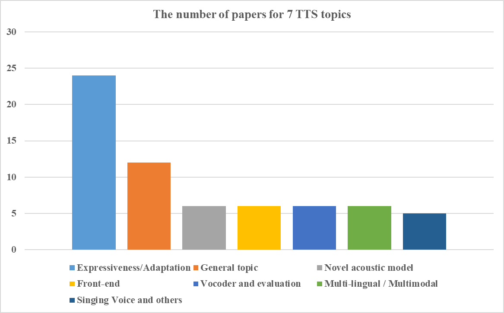
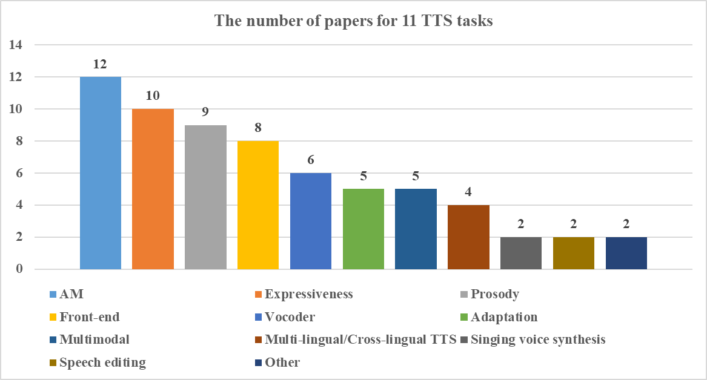
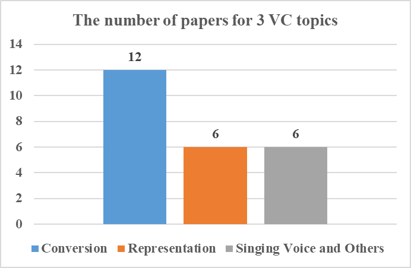
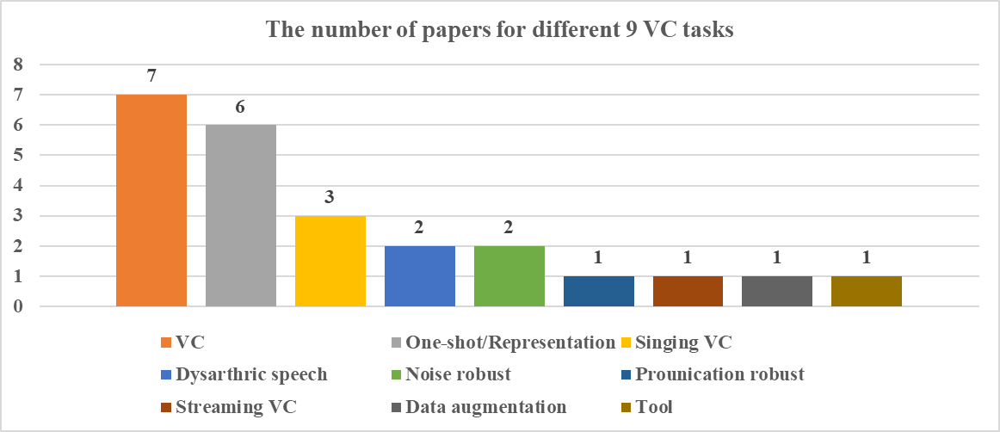

# ICASSP2022 TTS&amp;VC Summary

总结了ICASSP2022中TTS和VC相关论文，主要是TTS。统计了sessions，topics，tasks/motivation以及对应的论文数量。
* TTS相关工作最多的是acoustic model，其次是expressiveness和prosody。
* Acoustic model主题中关于模型结构的论文居多，其次是关于AM中的时长建模。
* Expresiveness主题中关于disentanglement的论文居多。
* Prosody主题中关于control的论文居多。
* Front-end主题中关于G2P，多音字消歧的论文居多。
* Vocoder主题中大多是提升效率的论文。
* Multimodal主题中关于配音(dubbing)的论文居多。

*** 

## Content
### [TTS](#tts)
* [Sessions](#tts_sessions)
* [Topics](#tts_topics)
* [Tasks](#tts_tasks)
    * [Acoustic model](#am)
    * [Expressiveness](#expressiveness)
    * [Prosody](#prosody)
    * [Front-end](#front_end)
    * [Vocoder](#vocoder)
    * [Adaptation](#adaptation)
    * [Multimodal](#multimodal)
    * [Multi-lingual/Cross-lingual TTS](#multilingual_cross_lingual)
    * [Singing voice synthesis](#svs)
    * [Speech editing](#speech_editing)
    * [Others](#others)

### [VC](#vc)
* [Sessions](#vc_sessions)
* [Tasks](#vc_tasks)

*** 

## TTS 
### TTS Sessions  
|          | Sessions        | #Sessions     | #Papers |
| ------------- | ------------- | ------------- | ------------- |
|1 | Expressiveness/Adaptation  | 4  | 24  |
|2 | General topic  | 2  | 12  |
|3 | Novel acoustic model  | 1  | 6  |
|4 | Front-end  | 1  | 6  |
|5 | Vocoder and evaluation  | 1  | 6  |
|6 | Multi-lingual/Multimodal  | 1  | 6  |
|7 | Singing Voice and others | 1  | 5  |
| Total | 7  | 11   | 65   |

 </img>
 

### TTS Topics  
|    | Topics  | #Papers | 
| ------------- | ------------- | ------------- | 
|1 | Acoustic model  | 12  |
|2 | Expressiveness  | 10  | 
|3 | Prosody    | 9  |
|4 | Front-end  | 8  | 
|5 | Vocoder  | 6 | 
|6 | Adaptation  | 5  | 
|7 | Multimodal | 5  | 
|8 | Multi-lingual/Cross-lingual | 4  |
|9 | Singing voice synthesis | 2  | 
|10 | Speech editing | 2  | 
|11 | Others | 2  | 
| Total | 11   | 65 | 

 </img>
 

### TTS Task/Motivation  
#### AM (Acoustic model) 
|    | Tasks  | #Papers | 
| ------------- | ------------- | ------------- | 
|1 | Model  | 3  |
|2 | Duration  | 2  | 
|3 | Analysis    | 2  |
|4 | Input  | 1  | 
|5 | Speaker  | 1 | 
|6 | Efficiency  | 1  | 
|7 | Noisy data | 1  | 
|8 | Incremental TTS | 1  |
| Total | 8   | 12 | 

#### Expressiveness 
|    | Tasks  | #Papers | 
| ------------- | ------------- | ------------- | 
|1 | Disentanglement  | 3  |
|2 | Emotion  | 2  | 
|3 | Low-quality    | 1  |
|4 | Adaption  | 1  | 
|5 | Reference selection  | 1 | 
|6 | Conversational TTS  | 1  | 
|7 | Low-resource | 1  | 
| Total | 7   | 10 | 

#### Prosody 
|    | Tasks  | #Papers | 
| ------------- | ------------- | ------------- | 
|1 | Control  | 4  |
|2 | Rich prosody  | 2  | 
|3 | Cross-sentence context    | 2  |
|4 | Word-level prosody  | 1  | 
| Total | 4   | 9 | 

#### Front-end 
|    | Tasks  | #Papers | 
| ------------- | ------------- | ------------- | 
|1 | G2P  | 2  |
|2 | Polyphone disambiguation   | 2  | 
|3 | Prosodic structure prediction     | 1  |
|4 | POS model compression   | 1  |
|5 | End-to-end text normalization   | 1 | 
|6 | Mathematical formulas   | 1  |  
| Total | 6   | 8 | 

#### Vocoder 
|    | Tasks  | #Papers | 
| ------------- | ------------- | ------------- | 
|1 | Efficiency  | 4  |
|2 | New method   | 2  | 
| Total | 2   | 6 | 

#### Adaptation 
|    | Tasks  | #Papers | 
| ------------- | ------------- | ------------- | 
|1 | Speaker generation  | 1  |
|2 | VC for postprocessing  | 1  | 
|3 | Multimodal     | 1  |
|4 | Low-quality data   | 1  |
|5 | New structure   | 1 | 
| Total | 5   | 5 | 

#### Multimodal 
|    | Tasks  | #Papers | 
| ------------- | ------------- | ------------- | 
|1 | Dubbing  | 4  |
|2 | Speech-to-animation  | 1  | 
| Total | 2   | 5 | 

#### Multi-lingual/Cross-lingual TTS 
|    | Tasks  | #Papers | 
| ------------- | ------------- | ------------- | 
|1 | Data augmentation  | 1  |
|2 | Lifelong learning  | 1  | 
|3 | Triple loss     | 1  |
|4 | Improved structure   | 1  |
| Total | 4   | 4 | 

#### Singing voice synthesis 
|    | Tasks  | #Papers | 
| ------------- | ------------- | ------------- | 
|1 | End-to-end | 1  |
|2 | Melody unsupervision  | 1  | 
| Total | 2   | 2 | 

#### Speech editing 
|    | Tasks  | #Papers | 
| ------------- | ------------- | ------------- | 
|1 | Speech editing | 2  | 
| Total | 1   | 2 | 

#### Others  
|    | Tasks  | #Papers | 
| ------------- | ------------- | ------------- | 
|1 | MOS net | 1  |
|2 | Phase reconstruction  | 1  | 
| Total | 2   | 2 | 

****
## VC  
### VC Sessions  
|          | Sessions        | #Sessions     | #Papers |
| ------------- | ------------- | ------------- | ------------- |
|1 | Conversion  | 2  | 12  |
|2 | Representation  | 1  | 6  |
|3 | Singing voice and others  | 1  | 6  |
| Total | 3  | 4   | 24   |

 </img>
 

### VC Tasks  

|    | Topics  | #Papers | 
| ------------- | ------------- |------------- |
|1 | VC  | 7  |
|2 | One-shot/Representation  | 6  | 
|3 | Singing VC    | 3  |
|4 | Dysarthric speech  | 2  | 
|5 | Noise robust  | 2 | 
|6 | Prounication robust  | 1  | 
|7 | Streaming VC | 1  | 
|8 | Data augmentation | 1  |
|9 | Tool | 1  | 
| Total | 9   | 24 | 

 </img>
 